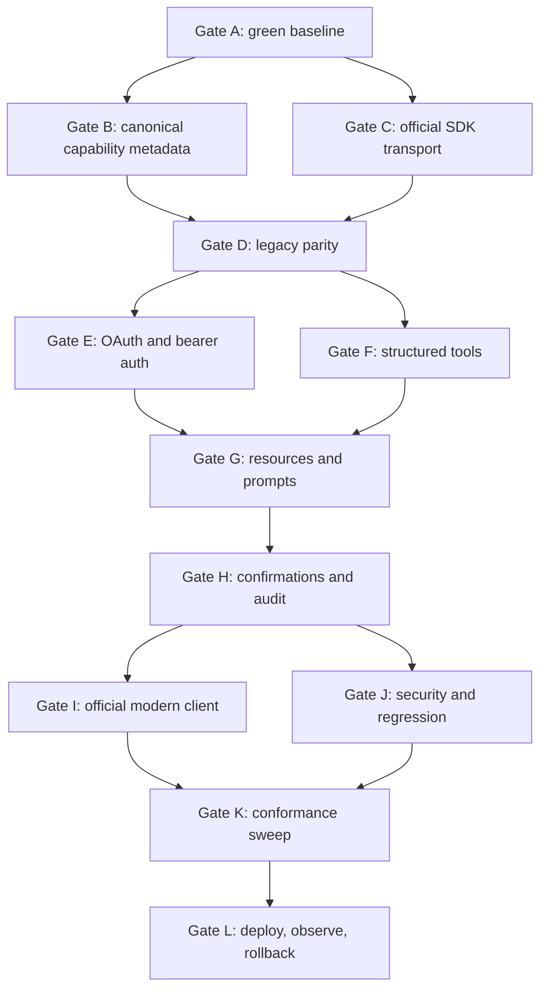

# Kinrows MCP architecture and rollout gates

Decision date: 2026-08-30
Status: implemented; deployment remains an operational decision

## Decision

`POST /v1/mcp` is served by the official Model Context Protocol TypeScript SDK v2. One canonical capability registry serves modern `2026-07-28` clients and stateless 2025-era clients. The existing REST API and manual `kr_live_…` bearer-key setup remain compatible.

The MCP surface intentionally uses the same 23 consolidated tools and 117 underlying handlers as Concierge. There is no second business-logic implementation: household isolation, action validation, and database mutations remain in `services/conciergeTools.js`.

## Delivery DAG



Each gate is accepted only after its focused tests and the accumulated regression suite pass. Failures stop downstream rollout; no gate is waived because a later test happens to pass.

## Gate record

| Gate | Deliverable | Verification |
|---|---|---|
| A | Repaired stale binary-avatar regression and idempotent migration warning | Focused payload test; full 182-test pre-MCP suite |
| B | `mcpDefinitions()` and exact call-time `operationMetadata()` | Registry startup assertion still proves every raw handler is routed once |
| C | Official SDK v2 Streamable HTTP endpoint | Syntax checks; SDK-backed initialize/ping tests |
| D | 2025 clients, notifications, batches, and JSON fallback preserved | Expanded `developer-api.test.js` |
| E | OAuth discovery, DCR, consent, S256 PKCE, single-use codes, rotation, revocation | `mcp-oauth.test.js` end-to-end flow |
| F | JSON Schema input validation, annotations, output schema, `structuredContent` | Legacy and official-client call assertions |
| G | Three static resources, one resource template, five prompts | Legacy and modern list/read/get assertions |
| H | `confirm: true` for delete/cancel and payload-free audit events | Confirmation and audit-resource assertions |
| I | Pinned modern protocol negotiation through the official client SDK | `mcp-modern.test.js` verifies `2026-07-28` |
| J | Scope, tenant isolation, entitlement lapse, token replay, unsafe redirects, DNS rebinding, bounded concurrency | Developer API + OAuth security tests; 40-request MCP concurrency sweep |
| K | Official conformance smoke suite | `npm run test:mcp:conformance` |
| L | Operational deployment and monitoring | Deploy only after CI; rollback is the previous release artifact |

## Security boundaries

- API keys, authorization codes, access tokens, and refresh tokens are opaque random values and only SHA-256 hashes are stored.
- OAuth public clients must use an exact registered HTTPS redirect URI or an HTTP loopback URI. S256 PKCE is mandatory; authorization codes expire in ten minutes and can be claimed once.
- Every request revalidates the household's paid entitlement. Read-only OAuth/API credentials cannot mutate through REST or MCP.
- MCP `Host` and browser `Origin` validation happens before bearer authentication. Additional production aliases require `KINROWS_ALLOWED_HOSTS`; canonical discovery URLs use `KINROWS_PUBLIC_URL` when set.
- Audit rows contain operation metadata and timing only. Inputs, outputs, messages, notes, and other household payloads are excluded.
- Destructive MCP actions are conservative: delete/cancel calls do not reach the underlying handler without `confirm: true`.

## Compatibility and rollback

- `/v1/me`, `/v1/snapshot`, `/v1/tools`, and `/v1/tools/:name` are unchanged.
- Existing MCP clients without a useful `Accept` header receive the former JSON response framing. Standards-aware clients receive normal SDK Streamable HTTP responses.
- GET remains `405` and DELETE remains `204` on the stateless MCP URL.
- `MCP_ENABLED=0` is the immediate kill switch: MCP returns `503` with `Retry-After`, while the REST Developer API remains available. A release rollback remains safe because the OAuth and audit tables are additive.

## Operations

Required production configuration:

- `KINROWS_PUBLIC_URL=https://kinrows.com`
- `KINROWS_ALLOWED_HOSTS=kinrows.com,www.kinrows.com` plus any explicitly supported alternate MCP hostname
- Node.js 20 or newer

OAuth consent currently uses the existing password-backed web session while `AUTH_2FA_ENABLED=0`. Before enabling the web 2FA flag, add a browser/app 2FA handoff for OAuth sign-in; the existing `/login` route intentionally refuses password-only authentication when that flag is enabled.

Verification commands:

```bash
npm test
npm run test:mcp:conformance
npm audit
```

Current protocol references:

- [MCP 2026-07-28 release](https://blog.modelcontextprotocol.io/posts/2026-07-28/)
- [TypeScript SDK protocol versions](https://ts.sdk.modelcontextprotocol.io/v2/protocol-versions)
- [MCP HTTP serving guide](https://github.com/modelcontextprotocol/typescript-sdk/blob/main/docs/serving/http.md)
- [MCP authorization specification](https://modelcontextprotocol.io/specification/2025-11-25/basic/authorization)
- [Official conformance suite](https://github.com/modelcontextprotocol/conformance)
