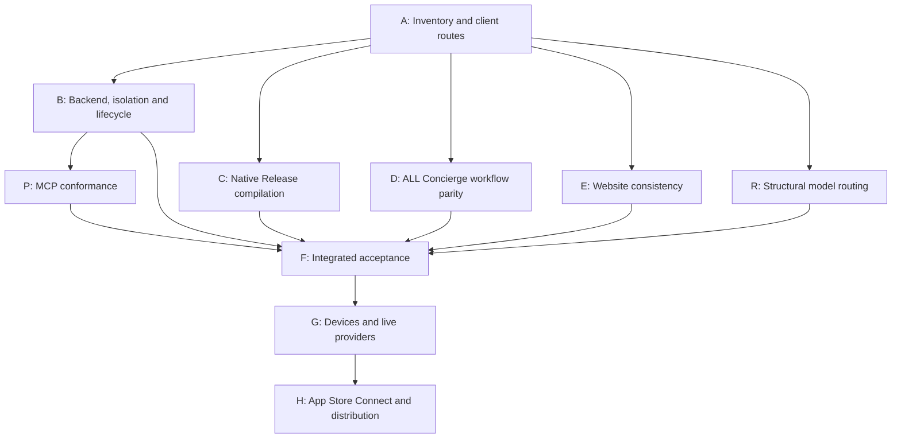

# Kinrows release QA — 2026-09-21

**Release decision: HOLD. Do not submit this as an App Store-ready release yet.**

The QA session found and fixed meaningful defects, but **the requested ALL-workflow Concierge requirement is not satisfied**. The current registry exposes 123 handlers through 25 model-facing tools; the app-workflow inventory identifies **40 missing operations in 14 areas**, plus nine native handoffs requiring acceptance evidence. Passing the existing tool contracts never established complete app coverage.

This audit used the working checkout, isolated SQLite databases, a new iPhone 17 Pro simulator running iOS 26.5, native Chrome, and read-only public production probes. No production household/waitlist records were changed, no email/push was sent to real people, no purchase was made, and nothing was deployed or submitted. Existing untracked developer files were left alone.

## Verification DAG

| Gate | Evidence required | Session conclusion |
|---|---|---|
| A | App/route/handler inventory and toolchain | PASS: 217 client call sites match 267 server route declarations; Xcode 26.6/iOS SDK 26.5 |
| B | Behavior, authorization, persistence, deletion, auth failures | Automated suite passes; Apple revocation and retained shared content still block privacy acceptance |
| C | Release app and widget compile; inspect bundled metadata | Local unsigned simulator build passes; signed device archive is NOT VERIFIED |
| D | Every non-Settings workflow has an authorized, tested Concierge operation | **FAIL: 40 missing operations; native handoffs unverified** |
| E | Claims, prices, policy, support, waitlist, generated pages | Source copy corrected; desktop/waitlist verified; deployment and mobile layout still unverified |
| P | MCP transport smoke checks after backend tests release their ports | PASS: five official conformance scenarios |
| R | Existing routing intents expressible in schemas | PASS: 60/60 structural cases; live model calls SKIPPED because no key was available |
| F | UI → client → route → authorization → DB → visible refresh | Partial evidence below; **BLOCKED** as a release gate by D and remaining privacy gaps |
| G | Real StoreKit, APNs, Apple sign-in, permissions, accessibility and AI | NOT VERIFIED; BLOCKED from acceptance |
| H | Signed distribution, App Store Connect metadata/products/forms/reviewer access | NOT VERIFIED; BLOCKED |

Reproduce with `npm run qa:release -- --native`. The runner executes prerequisites, saves per-node logs and `results.json` to an isolated temporary directory, and exits nonzero on HOLD. `npm run qa:wiring` checks route wiring; `npm run qa:concierge` deliberately fails until workflow parity is achieved. `--native` verifies an **unsigned simulator build**, not distribution signing. `KINROWS_QA_DERIVED_DATA` can point to an existing QA build cache.

The runner’s B/E/R PASS statuses describe their automated checks only. They do not override the broader privacy, product, visual, or live-provider gates in this report. No test count, screenshot, or static route match can approve G/H.

## Apple requirement applicability

| Review area | Evidence / disposition |
|---|---|
| 1.1/1.2 content and UGC | Household messaging/feed make UGC rules applicable. Report exists; block/filter acceptance FAILS. |
| 1.3 children | Terms/sign-in limit account creation to adults; app stores dependents’ data. Do not choose Kids Category or infer a 4+ rating without the current questionnaire. |
| 1.4 physical safety/health | Cycle/fertility and sleep guidance are present. Source code includes educational limitations/sources and age gates; medical-claim/content review and real UI presentation remain required. It must not claim contraception or medical diagnosis. |
| 1.5/1.6 support and security | Public support works; auth/isolation tests pass after fixes. Operator response, remaining retention and install-chain risks are not certified. |
| 2.1/2.2 completeness | Builds/smoke paths pass; live services, all workflows, reviewer access and purchasable products remain unverified. Website may describe a waitlist; submission metadata must describe the actual release. |
| 2.3 metadata | Corrected overclaims. Screenshots, app description, current rating, price localization and metadata in App Store Connect remain unverified. |
| 2.4/2.5 hardware/APIs | Native SwiftUI, public frameworks, iOS 18 minimum with iOS 26.5 SDK, app/widget build and 1024×1024 opaque icon verified. Small-screen/iPad presentation, device background behavior and provisioning remain unverified. |
| 3.1 payments | StoreKit-native paywall corrected; real purchases/renewals/restoration/refunds/server notifications pending. Website Stripe billing is a separate channel. |
| 3.2 business models | Paid household digital features identified; no ads, gambling, crypto or real-money rewards found in this audit. Recheck if product scope changes. |
| 4 design/login | Native feature set and Apple/password login are implemented. VoiceOver/Dynamic Type/full device usability still need acceptance. No third-party social login requiring another equivalent option was found. |
| 5.1 privacy | Policy and declarations improved. Account deletion/revocation, shared-content retention, operational policy and final App Privacy answers remain blocked or unverified. |
| 5.2 intellectual property | Brand/icon assets are present. Ownership/licenses for all artwork, fonts, marketing screenshots and quoted competitor reviews are not established by build/tests; verify before submission. |
| 5.3–5.6 and territory obligations | No gambling, VPN, MDM or developer-conduct features were found that change the applicable release path. Actual age/territory/trader/tax/agreements and local obligations need account-owner evidence. |
| Current upload requirements | Available Xcode/SDK meet Apple’s published 2026 minimum. Age questionnaire, signing validation, export and EU trader status remain App Store Connect gates. |

## Fixed in this session

| Finding | Change | Verification |
|---|---|---|
| In-app Subscribe sent every storefront to Stripe, with no storefront/entitlement gating | Native paywall uses StoreKit products and localized Apple prices only; web checkout remains on the website | Release/Debug compilation; native unavailable-catalog state, Restore and legal links visible; real purchase still pending |
| Transaction update listener finished purchases before backend verification | Finish only after server verification; surface purchase, pending, restore and catalog failures | Native compilation; live StoreKit recovery still pending |
| Disclosure promised no personal identifiers and immediate provider deletion | Accurate provider/data/retention copy; v2 consent keys require re-consent; readable Markdown and scrollable disclosure | Native disclosure viewed; decline/reopen/accept tested; final source compiles |
| Automatic brief requests/scheduled briefs could send data to AI without first-use consent | Automatic briefs are deterministic/server-local; optional on-device prose remains; no automatic cloud brief requests | Tests spy on enabled provider and prove zero calls; HTTP `skipAI=false` cannot re-enable it |
| Consent survived logout and was not checked at all API entry points | Clear grants on logout or cloud-AI disable; enforce feature-specific grants before receipt, recipe and both chat transports | Source/build verification; native first-use and decline behavior; further shared-device acceptance remains in G |
| Health/cycle/sleep collection absent from privacy manifest; widget shared defaults undeclared | Add Health, stored APNs Device ID and Contacts collection plus App Group reason `1C8F.1`; widget gets its own bundled manifest; update privacy-label worksheet | Inspect both built `.xcprivacy` files, not just source presence |
| Account deletion left private health routines, synced calendars, OAuth state/preferences and child rows | Explicit transactional cleanup, including sole-household child tables that cannot be deleted by `group_id` | New raw-storage regression tests for surviving and sole-owner households |
| Other-device cookie sessions survived password changes/deletion | Credential-bound cookie sessions, account-existence check, session-store purge | Tests prove old cookies reject reads/writes and current password-changing device remains usable |
| Six baseline tests expired when fixed infant birthdates aged past their intended band | Relative-age fixtures for current-age tests; fixed-date boundary tests retained | Full backend suite |
| Runtime `qs` advisory | Lockfile upgrade from 6.15.3 to 6.16.0 | Full suite; follow-up audit removes moderate advisory |
| Website/native claims exceeded implementation or contradicted each other | Bound Concierge claims; correct tool count, free daily brief, billing channels, support login/export instructions, provider retention, health collection and waitlist email expectations | Generated SEO rebuild/check, web regressions, native walkthrough, desktop website and local waitlist submission |

**Deployment behavior:** credential-bound sessions cause pre-change cookie sessions to reauthenticate once. Revocable device refresh tokens still support silent re-login. The disclosure version intentionally asks existing users to review the corrected AI terms. Automatic briefs no longer use cloud-generated prose. Deploy backend, app, and website changes together before evaluating the final candidate.

## Remaining release blockers

### B1 — User-generated-content safety is incomplete

`POST /api/content/report` and DM/feed report UI exist. No user-blocking implementation or objectionable-content filtering was found in the audited message/feed routes. Household invitations and leaving a group do not establish blocking/filtering coverage. The older checklist incorrectly says “report + block exists.”

Acceptance: an abusive member can be blocked; blocked DMs/content are denied or hidden across UI, API, notifications and Concierge; reporting reaches a monitored queue with a response procedure; filtering/moderation covers relevant user-generated content. Test both members of one household and shared-clan relationships. Relevant Apple guideline: 1.2.

### B2 — Sign in with Apple account revocation is missing

Deletion reauthenticates an Apple identity token, but `services/appleSignIn.js` only verifies identity tokens. No authorization-code exchange/token storage/revocation integration was found. Local deletion alone does not revoke the Apple authorization.

Acceptance: implement and verify code exchange and `/auth/revoke`, handle token/provider failures and accounts linked to both password and Apple, then prove deletion/re-registration using a real Apple sandbox/device account. Credentials and developer configuration are needed for end-to-end evidence. Relevant Apple guideline: 5.1.1(v), TN3194.

### B3 — Finish the deletion/retention audit

The fixed private-data leaks are covered by tests, but shared authored content remains by design: `deleteUserAccount` anonymizes `feed_posts.author_id` and keeps some shared household records, including name-bearing fields. Apple’s account-deletion guidance also addresses user-generated content. Determine and implement the complete removal policy for shared posts, photos, named health/rivalry entries, reports, outbox payloads and backups; do not describe removing an author ID as erasing all personal content. Verify other family members retain only data that is meant to survive.

Acceptance also needs subscription-cancellation failure handling: the current Stripe deletion path swallows cancellation errors, so a sole-owner account can be erased while billing cancellation failed. Apple subscriptions require clear cancellation guidance because deleting an app account does not cancel the Apple subscription.

### D — Concierge must cover the app, not just its existing tools

The machine-readable inventory is [concierge-workflows.json](concierge-workflows.json); resolved structural evidence is [wiring-evidence.json](wiring-evidence.json).

| Missing area | Operations missing from the current handler surface |
|---|---|
| Calendar attachments | Read, attach, detach |
| Lists | Pin, unpin, reorder items; broader list metadata also needs field-level review |
| Budget | Historical statistics; read project expenses |
| Decisions | Edit/resolve configuration; read reactions and comments |
| Saved addresses | Create, edit, delete |
| Itineraries | Request a stay, respond, read pending hosting requests, read itinerary expenses |
| Rivalries | Edit configuration, read score entries, read leaderboard |
| Coverage | Detailed request and coverage-block reads |
| Routines | General creation/edit/deletion/sharing; entry correction/deletion; occurrences |
| Feed | Read posts, delete posts, read/remove reactions, read comments |
| Messages | Read conversations/messages and mark read; existing send handler is text-only |
| Concierge memory | Read/delete saved memory |

Settings/auth/billing administration are outside the requested Concierge scope. Family/clan screens are **not** excluded just because Settings also links to them.

For each missing operation: implement through shared domain logic; enforce actor/household/private-record ownership; define required confirmation; expose the grouped schema; prove valid calls and denial cases; read the persisted result through the same HTTP/Swift model as the screen; verify action publication refreshes the screen; add live natural-language intent cases. Handler names in the inventory are acceptance IDs and can be mapped to equivalent implementations after verification.

Native handoffs need separate coverage for camera/receipt review, recipes/saved cooking state and ingredient deduction, EventKit permissions/import/export, trip location/geofences, HealthKit sync, photos/content reports, family/clan membership/sharing, conversation history, and reminders. Some infrastructure already exists (trip polling and routine reminder refresh, for example); these are **unverified handoffs**, not assertions that all native functionality is missing.

Read tools often cap results or return previews. “All workflows” must include pagination/full-detail retrieval and field-level parity, not just CRUD names. Current tests do not prove every valid action, every Swift decode, or every arbitrary natural-language request.

### G1 — Real subscriptions and provider acceptance

The simulator returned no StoreKit products. The corrected paywall handles that honestly, but this is not proof that App Store Connect products exist or are purchasable. Verify four exact `com.kinrows.app.concierge.{lite,premium}.{monthly,yearly}` products, subscription group/rank, localizations, prices, tax/banking/agreements, restoration, upgrade/downgrade, pending approval, expiry, refund/revocation, and server notifications.

`services/subscription.js` rejects sandbox transactions on a production backend unless configured otherwise. Verify an explicit, safe review/TestFlight sandbox strategy; a Release app points at the production Railway API. Do not blindly disable transaction verification or globally comp users to make a paywall test pass.

No Anthropic key was available locally. The 60 routing cases were structural only. Run live model routing, multi-action conversations, refusals, correction/undo flows, provider timeouts, venue search citations, and all new workflow cases against fictional records before acceptance.

### G2/H — Device and submission evidence still required

- Real iPhone: Apple sign-in including Hide My Email, password recovery/2FA delivery, camera/photo denial, on-device speech availability, HealthKit denial, EventKit access, background trip/arrival behavior, production APNs and notification destinations.
- Accessibility: VoiceOver operation, largest Dynamic Type sizes, Reduce Motion, contrast and hit targets; smallest supported iPhone and iPad compatibility presentation. The disclosure is now scrollable, but a complete accessibility pass is not claimed.
- Signed archive/validation and TestFlight install: app/widget identifiers, matching versions, App Group, push/associated-domain/HealthKit/Apple-sign-in provisioning. Local build is 1.0 (1789085837); verify App Store Connect build uniqueness before uploading.
- Current App Privacy form, updated age-rating questionnaire (UGC plus health/wellness features), intended audience, export compliance, EU trader status if distributed there, release territories, complete screenshots and truthful metadata/support URLs.
- Reviewer demo credentials/full access and detailed notes for household sharing, subscriptions, health data and AI consent. Backend and support inbox must remain available during review.
- Deploy and repeat public probes; establish monitoring, backup restore evidence and release rollback. The source changes in this session are not live.

## Automated results

Final backend suite: **400 passed, 0 failed, 0 skipped**. Additional website/SEO regression pass: **18 passed**. The machine-readable executed DAG and per-gate logs are in [evidence/release-gates.json](evidence/release-gates.json). Baseline before changes was 384/390 passing.

## End-to-end evidence and limits

| Path | Evidence |
|---|---|
| Native account → API → Home | New isolated account created; native password sign-in succeeded; session restored after relaunch |
| Home → event form → API → storage → Home | Saved “QA launch rehearsal”; denied notifications; event appeared on Home and survived relaunch |
| Concierge tool → storage → iOS HTTP reads | New tests verify create/edit/delete in pantry, notes, contacts and recurring payments; outsider reads and writes rejected |
| Calendar cross-entry parity | Concierge adds recurring event; native HTTP endpoint reads it; HTTP edit changes the value returned by Concierge; delete removes it |
| Brief without consent/provider | Default and explicit `skipAI=false` API calls stay cloud-free; scheduled brief spy records zero provider calls; native on-device brief rendered |
| AI disclosure | Visible before first chat; decline keeps brief usable; opening chat asks again; accept opens chat |
| Provider-disabled chat | Native request responds that AI must be enabled; it does not pretend an action succeeded |
| Subscription failure UX | Unavailable products disable purchase buttons; no fallback to a misleading Stripe price; restore and policy/terms links visible |
| Marketing → waitlist → referral | Local Chrome form accepted a fictional `.invalid` address, displayed queue position #1 and local referral link; email delivery disabled |
| Public production health/legal | kinrows.com homepage, privacy, terms, support, health and AASA returned 200; Railway Release API health returned 200; HSTS present; AASA appID matches team/bundle |
| Website rendering | Desktop Chrome homepage visually inspected; native app and website use the same brand and feature names. Mobile/responsive browser pass remains incomplete |
| Swift streaming | Compiled production chat view model with fixture: paced reveal, authoritative reconciliation, thread protection, action deduplication, interrupted replies and Reduce Motion pass |

Static route matching does **not** prove payload shape, query semantics, decoding or all route-order interactions. Tool/DB/HTTP integration tests do **not** exercise the live model. Native smoke tests do **not** equal a full device matrix.

## Dependency and operational findings

`npm audit --omit=dev` initially reported eight vulnerabilities. Updating `qs` removes the runtime moderate finding. Seven remain (2 low, 4 high, 1 critical), in the sqlite3/node-gyp installation dependency tree including `tar`. They matter to the build/install environment even though they are not imported by request handlers. Review a tested sqlite3 6.x migration or a patched build dependency strategy; no forced major upgrade was made here. Do not label the audit clean.

The older production checklist’s assertions about enabled production keys, 2FA, comp entitlements, encrypted backups, StoreKit products, block support and deployment are not current evidence. Only public read-only probes were repeated; production secrets/configuration and actual App Store Connect state were not inspected.

## Sources reviewed

- [Apple App Review Guidelines](https://developer.apple.com/app-store/review/guidelines/): safety/UGC, completeness, accurate metadata, subscriptions, privacy and health-related features.
- [Upcoming submission requirements](https://developer.apple.com/news/upcoming-requirements/): Xcode 26/iOS 26 SDK, current age questionnaire and EU trader requirements.
- [App Privacy details](https://developer.apple.com/app-store/app-privacy-details/): collection categories and purposes.
- [Account deletion](https://developer.apple.com/support/offering-account-deletion-in-your-app/), [TN3194](https://developer.apple.com/documentation/technotes/tn3194-handling-account-deletions-and-revoking-tokens-for-sign-in-with-apple), [token revocation](https://developer.apple.com/documentation/signinwithapplerestapi/revoke-tokens).
- [Required-reason APIs](https://developer.apple.com/documentation/bundleresources/app-privacy-configuration/nsprivacyaccessedapitypes/nsprivacyaccessedapitype): App Group UserDefaults reason.
- [Sandbox testing](https://developer.apple.com/help/app-store-connect/test-in-app-purchases/overview-of-testing-in-sandbox).
- [Anthropic commercial retention](https://privacy.claude.com/en/articles/7996866-how-long-do-you-store-my-organization-s-data): the previous immediate-deletion promise was unsupported.

Apple makes the final review decision. This document records evidence and blockers; it is not a guarantee of approval.
